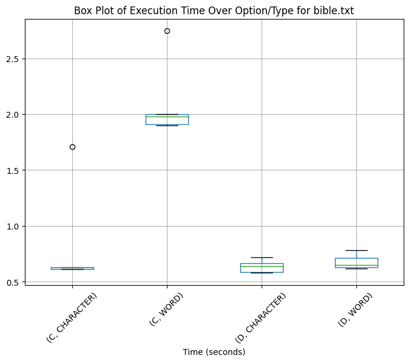
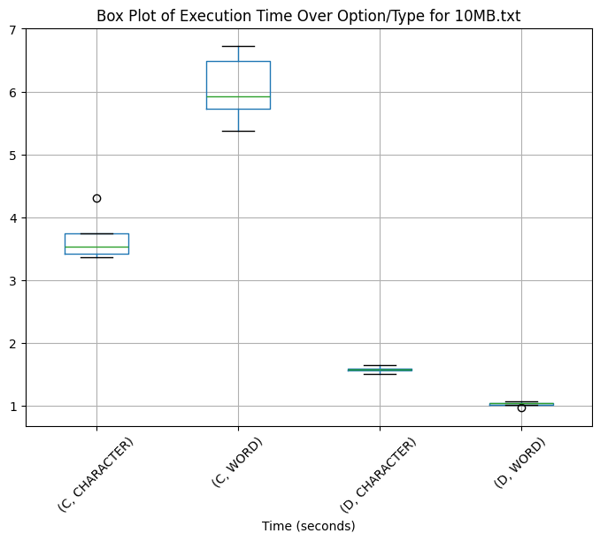
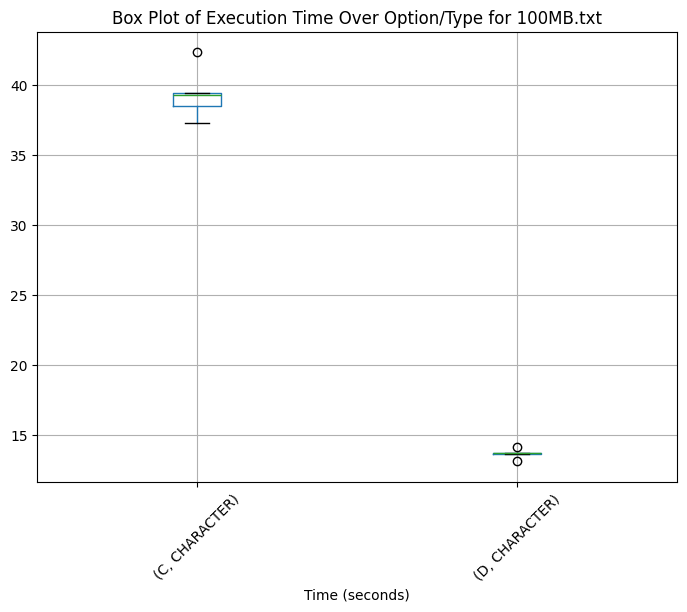

# Trabalho de PAA - Compressão com Huffman

## Alunos

Jedson Gabriel Ferreira de Paula

Aliana Wakassugui de Paula e Silva

## Comparativo de compressão

| Tipo      | Arquivo   |   Tamanho original (bytes) |   Tamanho comprimido (bytes) |   Tempo de compressão (s) |   Tempo de descompressão (s) |   Taxa de compressão |
|:----------|:----------|---------------------------:|-----------------------------:|--------------------------:|-----------------------------:|---------------------:|
| w      | 10MB.txt  |                1.09217e+07 |                  4.67213e+06 |                    6.0478 |                       1.0228 |             0.427783 |
| w      | bible.txt |                4.04739e+06 |                  2.70245e+06 |                    2.1074 |                       0.6772 |             0.667703 |
| c | 100MB.txt |                9.79852e+07 |                  5.90534e+07 |                   39.3776 |                      13.6618 |             0.602677 |
| c | 10MB.txt  |                1.09217e+07 |                  6.18967e+06 |                    3.6732 |                       1.5742 |             0.56673  |
| c | bible.txt |                4.04739e+06 |                  2.22078e+06 |                    0.839  |                       0.6382 |             0.548695 |

# Boxplots

## Metodologia

Foram executados uma bateria de 5 execuções para cada arquivo, e os valores apresentados são a média dos resultados obtidos.

Para conseguir o tempo de execução, foi utilizado o programa time do linux, que retorna o tempo de execução de um programa e retirado o tempo real.

